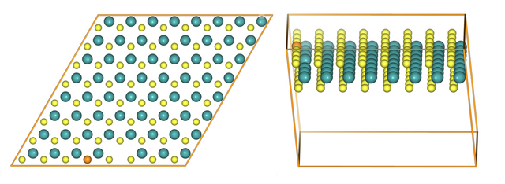
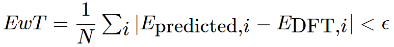

# Solutions for [International Data Analysis Olympiad](https://idao.world/)

## Team: BUDIMA
- [Marat Amirov, HoneyBad3er](https://github.com/HoneyBad3er)
- [Bulat Shelkhonov, bshelkhonov](https://github.com/bshelkhonov)
- [Dmitry Mokeev, mokeevdmitrii](https://github.com/mokeevdmitrii)

# Semi-Final

## 📋 Task
\
Two-dimensional transition metal dichalcogenides (TMDCs) are relatively new types of materials that have remarkable properties ranging from semiconducting, metallic, magnetic, superconducting to optical. The chemical composition of TMDCs is MX₂; where M is the group of transition elements most popular Molybdenum and Tungsten, and X is usually Sulfur or Selenium. Atomically thin TMDCs usually contain various defects, which enrich the lattice structure and give rise to many intriguing properties. Engineered point defects in two-dimensional (2D) materials offer an attractive platform for solid-state devices that exploit tailored optoelectronic, quantum emission, and resistive properties. Naturally occurring defects are also unavoidably important contributors to material properties and performance. The immense variety and complexity of possible defects make it challenging to experimentally control, probe, or understand atomic-scale defect-property relationships. In the figure above you can find vacancy and substitution defects in an 8x8 MoS₂ crystal lattice.

Band gap is one of the important physical attributes which describe certain characteristics of the material, that helps deriving material qualities including electric conductivity or catalytic power or photo-optical properties. Band gap is the energy difference between the valence band and conduction band and is closely related to the energy difference between highest occupied molecular orbital (HOMO) and lowest unoccupied molecular orbital (LUMO), materials with overlapping (between valence band and conduction band) or very small band gap are conductors and materials with small bandgap are semiconductors while materials with large bandgap are insulators.

**The task is to predict band gap energy for each crystal structure.**

**Input format**\
The training dataset is in the data directory in the baseline and structured into a directory called structures containing 2967 crystal structures as a json file named with a unique identifier and is containing a special pymatgen structure (check pymatgen documentation for reference), that contains information about crystal parameters, cartesian coordinates of each atom, atom types, and other information.

The targets are stored in a csv file named targets.csv containing two columns; the first is the unique identifier of the structure and the other is the band gap value for each structure. The train and test sets are constructed by sampling the corresponding subset without replacement.

The training sample contains 1796 examples.

The public test sample contains 1484 examples.

The private test sample contains 1483 examples.

**Output format**\
Please upload your predictions into the system in the .csv format. The file should contain two columns: id, predictions

A sample submission can be found on GitHub.

**Quality Metric**\
Energy within Threshold (EwT) is designed to measure the practical usefulness of a model for replacing DFT by evaluating whether the predicted energy is close to the ground truth (DFT energy.EwT is defined as the fraction of structures in which the predicted energy is within ϵ=0.02eV (electronvolt) of the ground truth energy.
\
Where N is the number of samples in the dataset indexed by i.

## 🔨 Solution
\
TODO

## 🏁 [Results](https://idao.world/results/)
🎉 **Qualified to the IDAO 2022 Final** 🎉

| public score | private score| 
|--------------|--------------|
| 0,884        |0,893         | 
